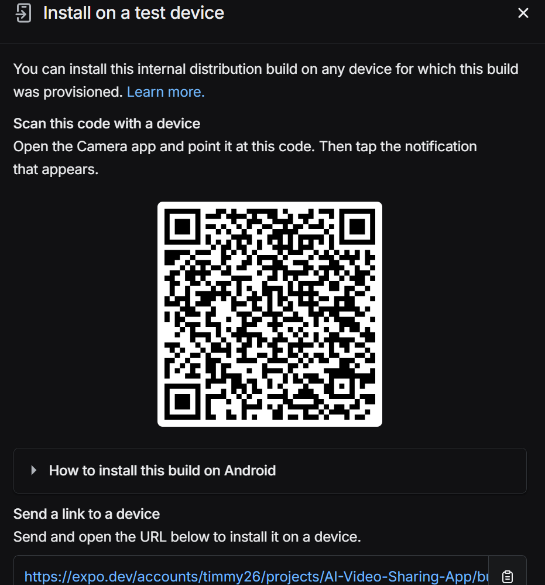

Aora - AI Video Sharing App
Welcome to Aora, an AI-powered video sharing app built with cutting-edge technologies to provide a seamless and engaging user experience. This project demonstrates my skills as a software developer, showcasing my ability to integrate various technologies and create a functional, user-friendly application.

use this link to install it on your device
https://expo.dev/accounts/timmy26/projects/AI-Video-Sharing-App/builds/1a57af22-9f25-44f9-a2b7-4fd79d8a0b15

Tech Stack
React Native: For building the mobile application.
Expo: To streamline the development process and provide a robust environment for building React Native apps.
NativeWind: For styling the application using Tailwind CSS in React Native.
Appwrite: As the backend service for authentication, database, and storage.
React Native Video: For video playback functionality.
React Native WebView: For rendering web content within the app.
Expo Router: For managing navigation within the app.
Expo Image Picker: For selecting images and videos from the device's library.
Expo Font: For custom font integration.
Expo Splash Screen: For managing the app's splash screen.
Expo Status Bar: For customizing the status bar appearance.
React Native Animatable: For adding animations to the app.
React Native Safe Area Context: For handling safe area insets.
React Native Gesture Handler: For handling gestures in the app.
React Native Reanimated: For creating smooth animations.
Tailwind CSS: For utility-first CSS styling.
Features
User Authentication: Sign up and sign in functionality using Appwrite.
Video Upload: Users can upload videos and thumbnails from their device.
Video Playback: Seamless video playback using React Native Video.
Search Functionality: Search for videos based on AI-generated prompts.
User Profile: View and manage user profiles and their uploaded videos.
Trending Videos: Display trending videos on the home screen.
Responsive Design: Optimized for both iOS and Android devices.
Custom Animations: Smooth animations for a better user experience.
Demonstration of Skills
This project demonstrates my ability to:

Integrate various technologies to build a cohesive application.
Implement user authentication and secure data storage.
Handle media uploads and playback efficiently.
Create a responsive and visually appealing user interface.
Manage state and data fetching in a React Native application.
Utilize modern styling techniques with NativeWind and Tailwind CSS.
Implement smooth animations and handle gestures.

License
This project is licensed under the MIT License.